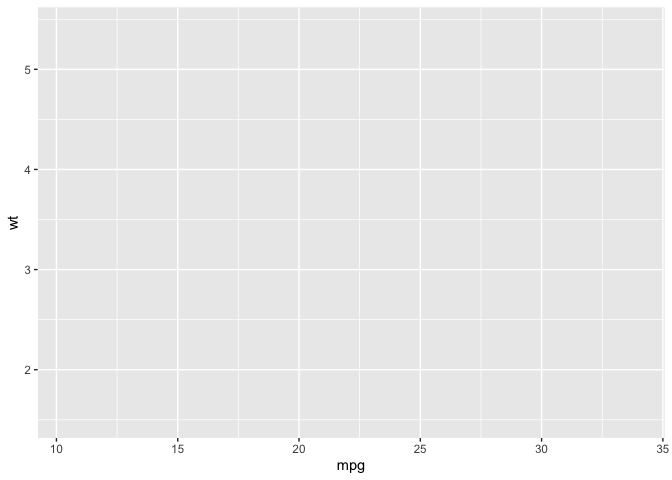
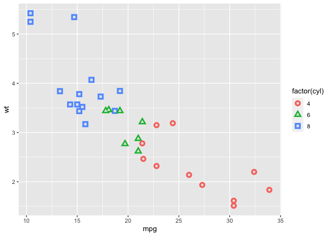
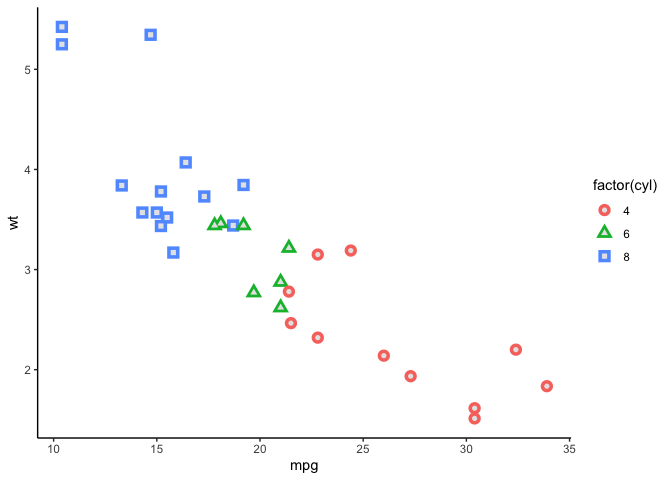
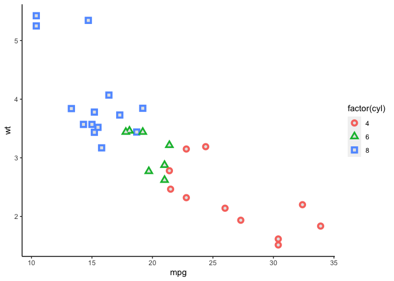
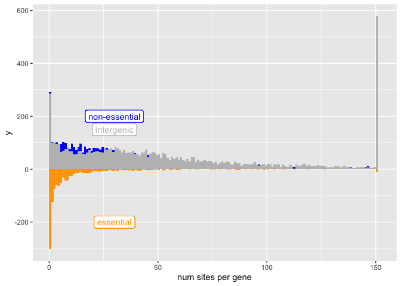

troubleshooting slow ggplot
================
Janet Young

2024-02-15

# understanding ggplot layers

blank plot as we didn’t add any geom yet

``` r
myplot <- ggplot(mtcars, aes(mpg, wt, shape = factor(cyl)))
myplot
```

<!-- -->

add two geom_point layers

``` r
myplot <- myplot +
    geom_point(aes(colour = factor(cyl)), size = 4) +
    geom_point(colour = "grey90", size = 1.5) 
myplot
```

<!-- -->

mess with aesthetics (here I didn’t save the updated plot but you
could). `theme_classic()` applies a whole bunch of changes

``` r
myplot + theme_classic()
```

<!-- -->

you can also change individual plot elements one at a time. google
searches are your friend for this (also `?theme`)

``` r
myplot + 
    theme(panel.background=element_blank()) + 
    theme(panel.grid.major = element_blank(), 
          panel.grid.minor = element_blank()) +
    theme(axis.line = element_line(colour = "black"))
```

<!-- -->

# trying to speed things up

Idea2:

make fake big data tibble (actually, I don’t need this because I
sneakily found Grant’s real data):

``` r
# random counts from poissoin distribution plus a few outliers
# essential_counts <- c( rpois(n=1995, lambda=2),
#                        c(1000,10000,5000,20000,3000) )
# nonessential_counts <- c( rpois(n=3995, lambda=50),
#                           c(1000,10000,5000,20000,3000))
# intergenic_counts <- c(rpois(n=5995, lambda=50),
#                        c(1000,10000,5000,20000,3000))
# # make a tibble
# mydat <- tibble(region_type=c(rep("essential", 2000),
#                               rep("non-essential",4000),
#                               rep("intergenic",6000)),
#                 counts=c(essential_counts,
#                          nonessential_counts,
#                          intergenic_counts))
```

``` r
# inFileStem <-"/fh/fast/malik_h/user/gking2/SATAY/240103_SATAY_Pilot_4.0/data/Robjects"
inFileStem <-"/Volumes/malik_h/user/gking2/SATAY/240103_SATAY_Pilot_4.0/data/Robjects"

# load(file=paste(inFileStem, "/all_regions.Rdata", sep=""))
# load(file=paste(inFileStem, "/all_regions_tbl.Rdata", sep=""))
load(file=paste(inFileStem, "/all_regions_nomito_tbl.Rdata", sep=""))
```

make smaller version of the tibble, and modified counts where we fake
any values \>150 to be 151

``` r
all_regions_nomito_small_tbl <- all_regions_nomito_tbl %>% 
    select(num_sites_pre, regionType) %>% 
    mutate(num_sites_pre_modified = case_when(num_sites_pre <=150 ~ num_sites_pre,
                                              TRUE ~ 151) ) 
```

``` r
essential_vs_nonessential_vs_intergenic <- all_regions_nomito_small_tbl %>%
    ggplot(aes(x=num_sites_pre_modified)) +
    geom_histogram(data= (all_regions_nomito_small_tbl %>% filter(regionType=="non-essential")),
                   aes(x = num_sites_pre_modified, y = ..count..), 
                   fill="blue", binwidth=1 ) +
    geom_label( aes(x=30, y=200, label="non-essential"), color="blue") +
    # geom_histogram(data= (all_regions_nomito_small_tbl %>% filter(regionType=="intergenic")),
    #                aes(x = num_sites_pre_modified, y = ..count..), 
    #                fill="gray", alpha = 0.8, binwidth=1 ) +
    # geom_label( aes(x=30, y=150, label="intergenic"), color="gray") +
    # geom_histogram(data= (all_regions_nomito_small_tbl %>% filter(regionType=="essential")),
    #                aes(x = num_sites_pre_modified, y = -..count..), 
    #                fill= "orange", binwidth=1) +
    # geom_label( aes(x=30, y=-200, label="essential"), color="orange") +
    xlab("num sites per gene") +
    coord_cartesian(xlim = c(0,150))
```

Idea1: Try rendering to a file rather than screen (width/height are in
inches). See if that’s faster than on screen. No - still slow - not
running right now

``` r
# ggsave("essential_vs_nonessential_vs_intergenic.pdf", 
#        essential_vs_nonessential_vs_intergenic, device="pdf", width=4, height=9)
```

still slow - not running right now

``` r
# essential_vs_nonessential_vs_intergenic
```

try solution from
[here](https://stackoverflow.com/questions/56607124/plotting-histogram-of-a-big-matrix-in-ggplot2-is-20x-slower-than-base-hist)

``` r
get_binned_counts <- function(values_vec, binsize=50) {
    dat_range <- range(values_vec) 
    my_breaks <- seq(from=dat_range[1], 
                     to=dat_range[2] + binsize, # add binsize to make sure we include the max value
                     by=binsize)
    # return(my_breaks)
    # get binned data in table form not plot
    res = hist(values_vec, plot=FALSE, breaks=my_breaks)
    # put it into a dataframe
    dat = data.frame(xmin=head(res$breaks, -1L),
                     xmax=tail(res$breaks, -1L),
                     ymin=0.0,
                     ymax=res$counts)
    return(dat)
}
```

get binned counts for each region type

``` r
all_regions_nomito_small_tbl_splitByType <- split(all_regions_nomito_small_tbl,
                                                  all_regions_nomito_small_tbl$regionType)
binnedCounts_splitByType <- lapply(
    names(all_regions_nomito_small_tbl_splitByType),
    function(eachRegionType) { 
        allDat <- all_regions_nomito_small_tbl_splitByType[[eachRegionType]]
        binCounts <- get_binned_counts (allDat$num_sites_pre_modified,
                                        binsize=1) 
        binCounts$regionType <- eachRegionType
        return(binCounts)
    } )

binnedCounts_allTypes <- bind_rows(binnedCounts_splitByType) %>% 
    as_tibble()
```

do the plot. not lighting fast, but faster!

for some aesthetic testing you can comment out 2/3 of the geom_rects
temporarily to speed things up

``` r
plot_v2 <- ggplot(binnedCounts_allTypes, 
                  aes(xmin=xmin, xmax=xmax, ymin=ymin, ymax=ymax)) +
    geom_rect(data= (binnedCounts_allTypes %>% filter(regionType=="non-essential")),
              aes(xmin=xmin, xmax=xmax, ymin=ymin, ymax=ymax),
              fill="blue") +
    geom_label( aes(x=30, y=200, label="non-essential"), color="blue") +
    
    geom_rect(data= (binnedCounts_allTypes %>% filter(regionType=="intergenic")),
              aes(xmin=xmin, xmax=xmax, ymin=ymin, ymax=ymax),
              fill="gray") +
    geom_label( aes(x=30, y=150, label="intergenic"), color="gray") +
    
    geom_rect(data= (binnedCounts_allTypes %>% filter(regionType=="essential")),
              aes(xmin=xmin, xmax=xmax, ymin= -ymin, ymax= -ymax),
              fill="orange") +
    geom_label( aes(x=30, y=-200, label="essential"), color="orange") +
    xlab("num sites per gene")

plot_v2
```

<!-- -->

``` r
## Grant's original code
# essential_vs_nonessential_vs_intergenic <- all_regions_nomito_small_tbl %>%
#     ggplot(aes(x=num_sites_pre_modified)) +
#     geom_histogram(data= (all_regions_nomito_small_tbl %>% filter(regionType=="non-essential")),
#                    aes(x = num_sites_pre_modified, y = ..count..), 
#                    fill="blue", binwidth=1 ) +
#     geom_label( aes(x=30, y=200, label="non-essential"), color="blue") +
#     # geom_histogram(data= (all_regions_nomito_small_tbl %>% filter(regionType=="intergenic")),
#     #                aes(x = num_sites_pre_modified, y = ..count..), 
#     #                fill="gray", alpha = 0.8, binwidth=1 ) +
#     # geom_label( aes(x=30, y=150, label="intergenic"), color="gray") +
#     # geom_histogram(data= (all_regions_nomito_small_tbl %>% filter(regionType=="essential")),
#     #                aes(x = num_sites_pre_modified, y = -..count..), 
#     #                fill= "orange", binwidth=1) +
#     # geom_label( aes(x=30, y=-200, label="essential"), color="orange") +
#     xlab("num sites per gene") +
#     coord_cartesian(xlim = c(0,150))
```

Ideas from before: can probably ignore

Maybe binsize is too small on the histogram- could you manage with lower
binsize?

Or, before you plot, remove the outliers that you’re not plotting
anyway, so that it calculates way fewer bin counts ?

``` r
# mydat %>%
# filter(relevant_counts <=150) %>%
# ggplot( etc)
```

In any case you wanted to consolidate the \>150 counts into a single
category – you could do that in a hacky way like this: (and in
Illustrator, you’d add the \>150 label on the plot)

``` r
# mydat %>%
# mutate(relevant_counts_modified = case_when(relevant_counts <=150 ~ 150,
# TRUE ~ 151) ) %>%
# ggplot( etc)
```

that could actually speed things up a lot, as it would mean that
relevant_counts_modified has a lot fewer histogram bins to calculate
